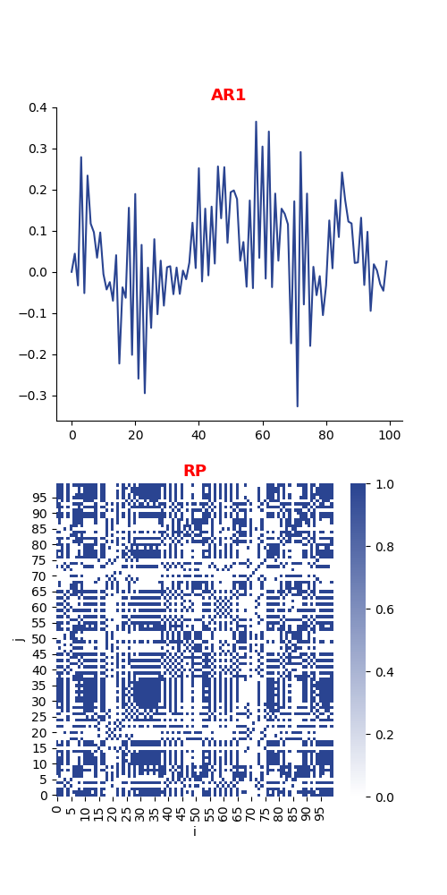
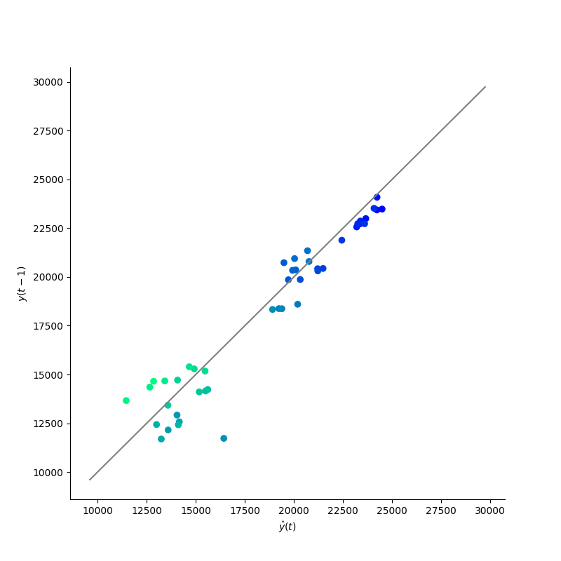
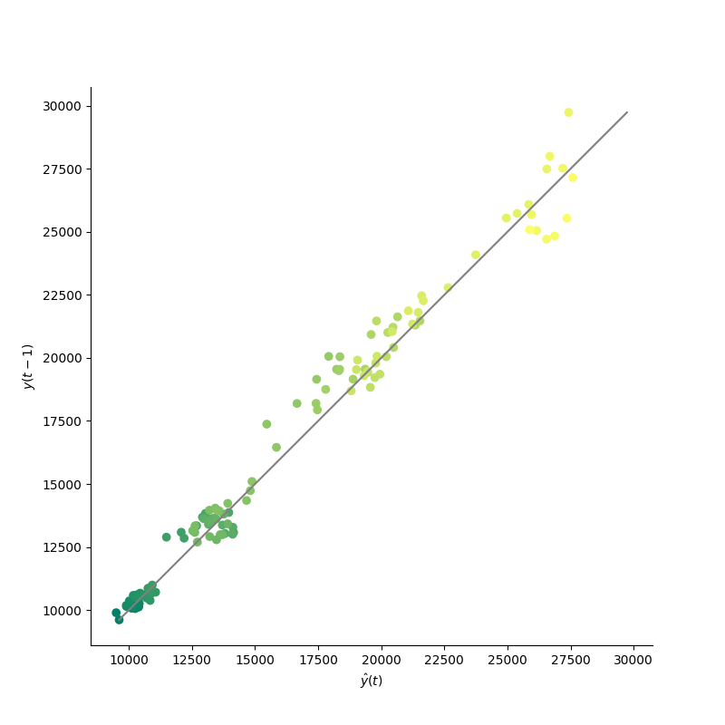
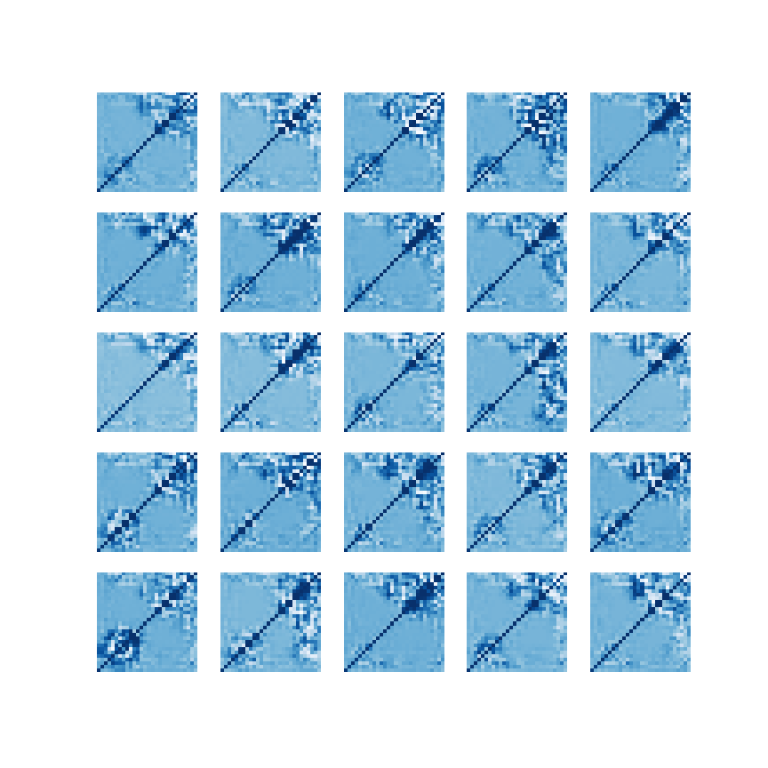
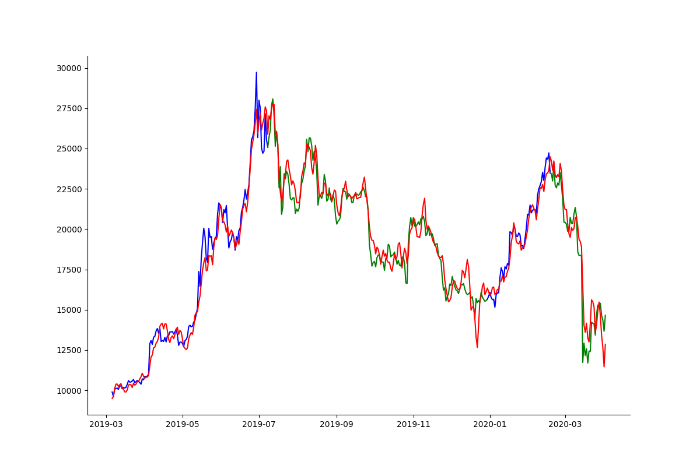
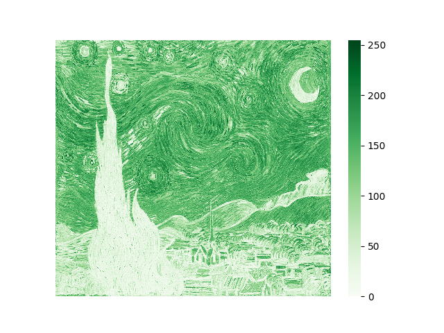
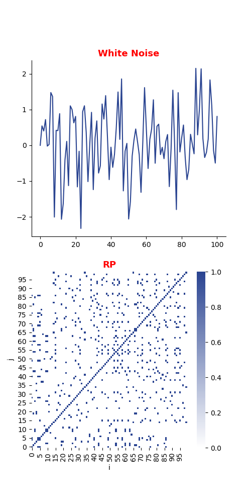

[](http://quantlet.de/)

## [](http://quantlet.de/) **GAN_TS_recurrence** [](http://quantlet.de/)

```yaml

Name of Quantlet: GAN_TS_recurrence

Published in: ''

Description: 'Time series simulation and analysis with GAN. Visualisation with recurrence plots.'

Keywords: 'GAN, recurrence plot, time series, non stationarity, simulation'

Author: ''

```




















### PYTHON Code
```python

# -*- coding: utf-8 -*-
"""WGAN_GP_TS_IMAGE.ipynb

Automatically generated by Colaboratory.

Original file is located at
    https://colab.research.google.com/drive/1Jfp-UTDh2UbKmAnEdDrtrfK0Oha2IzBH
"""

from __future__ import print_function, division

from tensorflow.keras.datasets import mnist
from tensorflow.keras.layers import Input, Dense, Reshape, Flatten, Dropout
from tensorflow.keras.layers import BatchNormalization, Activation, ZeroPadding2D, Conv2D,UpSampling2D,LeakyReLU
from tensorflow.keras.models import Sequential, Model
from tensorflow.keras.optimizers import RMSprop

import tensorflow.keras.backend as K
from google.colab import files

import matplotlib.pyplot as plt

import sys

import numpy as np


class WGAN():
    def __init__(self):
        self.img_rows = 28
        self.img_cols = 28
        self.channels = 1
        self.img_shape = (self.img_rows, self.img_cols, self.channels)
        self.latent_dim = 100

        # Following parameter and optimizer set as recommended in paper
        self.n_critic = 5
        self.clip_value = 0.01
        optimizer = RMSprop(lr=0.00005)

        # Build and compile the critic
        self.critic = self.build_critic()
        self.critic.compile(loss=self.wasserstein_loss,
                            optimizer=optimizer,
                            metrics=['accuracy'])
        self.d_loss_series = []
        # Build the generator
        self.generator = self.build_generator()
        self.g_loss_series = []

        # The generator takes noise as input and generated imgs
        z = Input(shape=(self.latent_dim,))
        img = self.generator(z)

        # For the combined model we will only train the generator
        self.critic.trainable = False

        # The critic takes generated images as input and determines validity
        valid = self.critic(img)

        # The combined model  (stacked generator and critic)
        self.combined = Model(z, valid)
        self.combined.compile(loss=self.wasserstein_loss,
                              optimizer=optimizer,
                              metrics=['accuracy'])

    def wasserstein_loss(self, y_true, y_pred):
        return K.mean(y_true * y_pred)

    def build_generator(self):

        model = Sequential()

        model.add(Dense(256 * 7 * 7, activation="relu", input_dim=self.latent_dim))
        model.add(Reshape((7, 7, 256)))
        model.add(UpSampling2D())
        model.add(Conv2D(256, kernel_size=4, padding="same"))
        model.add(BatchNormalization(momentum=0.8))
        model.add(Activation("relu"))
        model.add(UpSampling2D())
        model.add(Conv2D(128, kernel_size=4, padding="same"))
        model.add(BatchNormalization(momentum=0.8))
        model.add(Activation("relu"))
        model.add(Conv2D(self.channels, kernel_size=4, padding="same"))
        model.add(Activation("tanh"))

        model.summary()

        noise = Input(shape=(self.latent_dim,))
        img = model(noise)

        return Model(noise, img)

    def build_critic(self):

        model = Sequential()

        model.add(Conv2D(32, kernel_size=3, strides=2, input_shape=self.img_shape, padding="same"))
        model.add(LeakyReLU(alpha=0.2))
        model.add(Dropout(0.4))
        model.add(Conv2D(64, kernel_size=3, strides=2, padding="same"))
        model.add(ZeroPadding2D(padding=((0, 1), (0, 1))))
        model.add(BatchNormalization(momentum=0.8))
        model.add(LeakyReLU(alpha=0.2))
        model.add(Dropout(0.4))
        model.add(Conv2D(128, kernel_size=3, strides=2, padding="same"))
        model.add(BatchNormalization(momentum=0.8))
        model.add(LeakyReLU(alpha=0.2))
        model.add(Dropout(0.4))
        model.add(Conv2D(256, kernel_size=3, strides=1, padding="same"))
        model.add(BatchNormalization(momentum=0.8))
        model.add(LeakyReLU(alpha=0.2))
        model.add(Dropout(0.4))
        model.add(Flatten())
        model.add(Dense(1))

        model.summary()

        img = Input(shape=self.img_shape)
        validity = model(img)

        return Model(img, validity)

    def train(self, epochs, batch_size=32, sample_interval=100):

        # Load the dataset
        X_train = np.load('ts_images_train.npy')

        # Rescale -1 to 1
        #X_train = 2*((X_train - X_train.min())/(X_train.max()-X_train.min()))-1

        

        #X_train = np.expand_dims(X_train, axis=3)

        # Adversarial ground truths
        valid = -np.ones((batch_size, 1))
        fake = np.ones((batch_size, 1))

        for epoch in range(epochs):

            for _ in range(self.n_critic):

                # ---------------------
                #  Train Discriminator
                # ---------------------

                # Select a random batch of images
                idx = np.random.randint(0, X_train.shape[0], batch_size)
                imgs = X_train[idx]

                # Sample noise as generator input
                noise = np.random.normal(0, 1, (batch_size, self.latent_dim))

                # Generate a batch of new images
                gen_imgs = self.generator.predict(noise)

                # Train the critic
                d_loss_real = self.critic.train_on_batch(imgs, valid)
                d_loss_fake = self.critic.train_on_batch(gen_imgs, fake)
                d_loss = 0.5 * np.add(d_loss_fake, d_loss_real)

                # Clip critic weights
                for l in self.critic.layers:
                    weights = l.get_weights()
                    weights = [np.clip(w, -self.clip_value, self.clip_value) for w in weights]
                    l.set_weights(weights)

            self.d_loss_series.append(1-d_loss[0])
            # ---------------------
            #  Train Generator
            # ---------------------

            g_loss = self.combined.train_on_batch(noise, valid)
            self.g_loss_series.append(1-g_loss[0])
            # Plot the progress
            print("%d [D loss: %f] [G loss: %f]" % (epoch, 1 - d_loss[0], 1 - g_loss[0]))
            self.write_losses()

            # If at save interval => save generated image samples
            if epoch % sample_interval == 0:
                self.sample_images(epoch)
            
            if epoch % 500 == 0:
                pass
                #self.save_models()
                

    def sample_images(self, epoch):
        r, c = 5, 5
        noise = np.random.normal(0, 1, (r * c, self.latent_dim))
        gen_imgs = self.generator.predict(noise)
        

        # Rescale images 0 - 1
        gen_imgs = 0.5 * gen_imgs + 0.5
        #gen_imgs = gen_imgs

        fig, axs = plt.subplots(r, c,figsize=(12,12))
        cnt = 0
        for i in range(r):
            for j in range(c):
                axs[i, j].imshow(np.fliplr(gen_imgs[cnt, :, :, 0]), cmap='Blues')
                axs[i, j].axis('off')
                cnt += 1
        fig.savefig("rp_%d.png" % epoch)
        #files.download("rp_%d.png" % epoch)
        plt.close()

    def write_losses(self):
        fig, ax = plt.subplots(figsize=(8, 8))
        ax.plot(self.g_loss_series, c='green',label='g')
        ax.plot(self.d_loss_series, c='blue',label='d')
        #ax.legend()
        ax.set_xlabel('Epochs')
        ax.set_ylabel('W')
        ax.spines['right'].set_visible(False)
        ax.spines['top'].set_visible(False)
        plt.savefig('loss_plot.png',transparent='true')
        plt.close()
    def save_models(self):
        self.critic.save('discriminator')
        self.generator.save('generator')

      
if __name__ == '__main__':
    wgan = WGAN()
    wgan.train(epochs=3000, batch_size=64, sample_interval=100)
    wgan.critic.save('generator')
```

automatically created on 2020-11-26